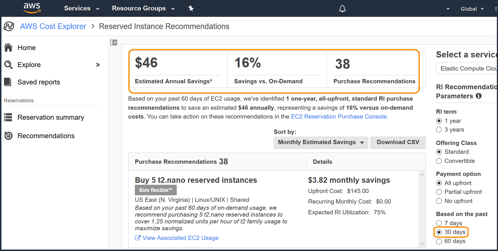
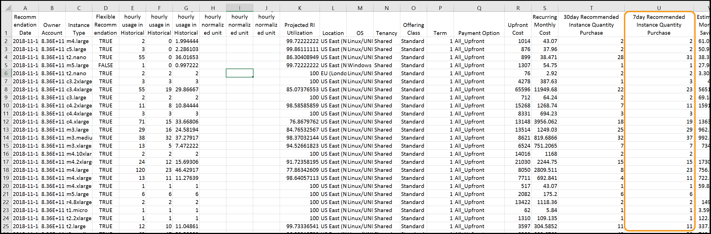
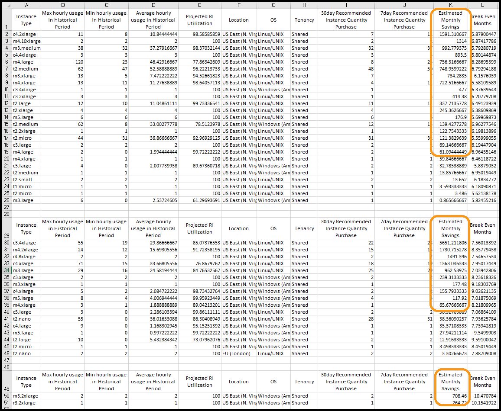
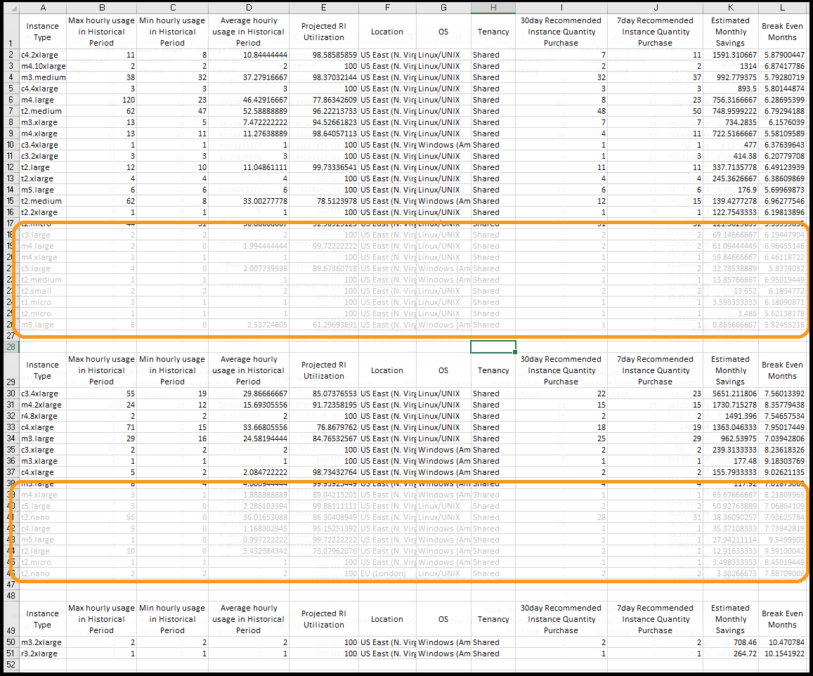
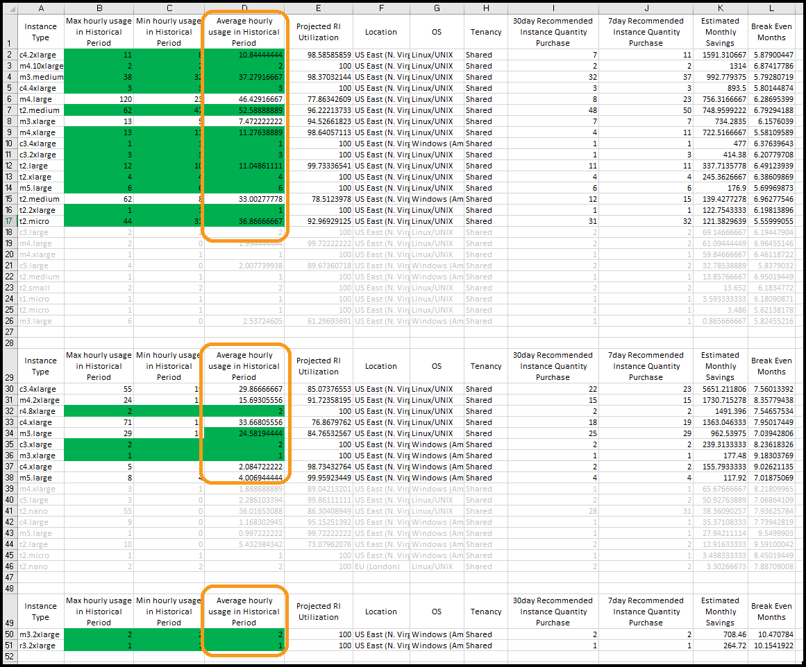
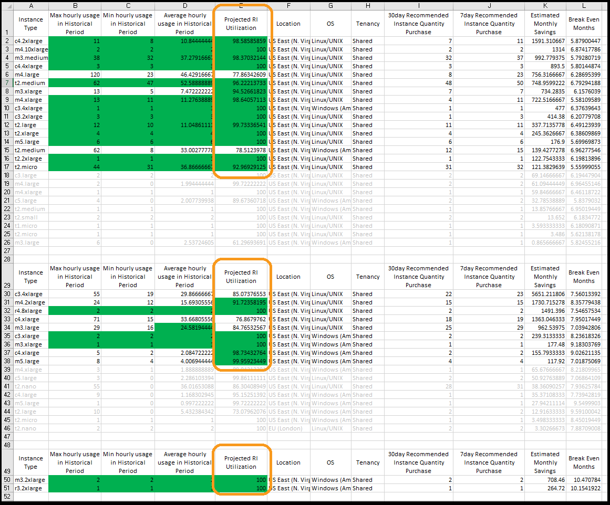
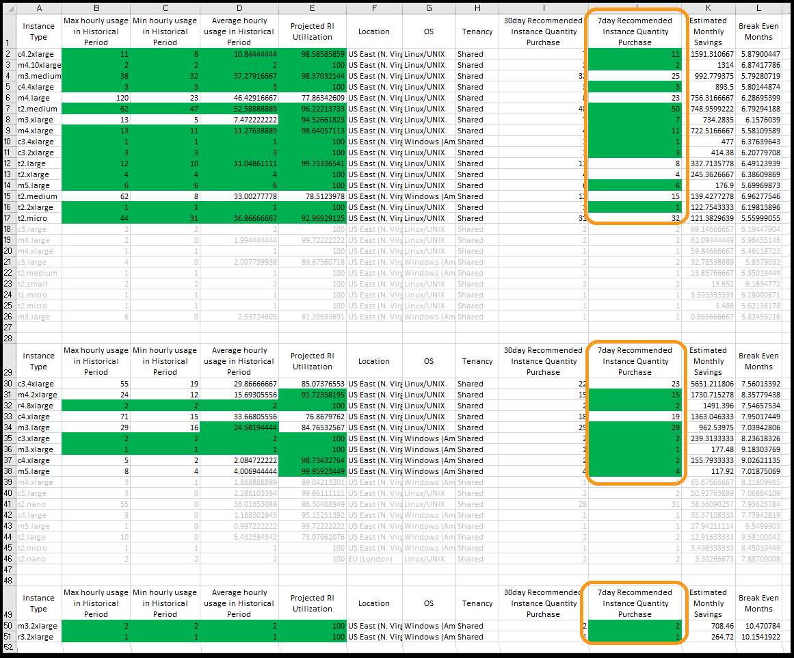

# Level 200: Pricing Models

## Authors
- Nathan Besh, Cost Lead, Well-Architected
- Spencer Marley, Commercial Architect
- Paul Lambden, Principal Technical Account Manager

## Feedback
If you wish to provide feedback on this lab, there is an error, or you want to make a suggestion, please email: costoptimization@amazon.com

# Table of Contents
1. [View an RI report](#ri_report)
2. [Download and prepare the RI CSV files](#prepare_csv)
3. [Sort and filter the RI CSV files](#filter_csv)
4. [Teardown](#tear_down)
5. [Rate this Lab](#rate_lab) 
6. [Feedback survey](#survey) 

## 1. View an RI report
We are going to view the RI reports within AWS Cost Explorer, to understand the recommendations and possible purchases we should make.

NOTE: We do all analysis using **All Up Front**, as this allows the break even to show when the entire 12month term is paid off. After the analysis is performed, select the required RI type.

1. Log into the console as an IAM user with the required permissions, go to the **AWS Cost Explorer** service page:

2. In the left menu select **Recommendations**: 

3. On the right select the filters: **RI term** 1 year, **Payment Option** All upfront, **Based on the past** 7 days:

The top section will show the estimated savings and number of recommendations, take note of the **Purchase Recommendations**

4. On the right select the filter: **Based on the past** 30 days:

View the **Purcahse Recommendations**, if the 30 day recommendation is less than 7 days recommendation - your usage is **increasing** and the recommendations are lower risk.  If the 7 days recommendation is less than 30 days, then your usage is **decreasing** and you need to look further into your usage patterns to see which RI's would be suitable.

## 2. Download and prepare the RI CSV files
1. Download the CSV for **both** the 7 day and 30 day recommendation files, by selecting the filter **7 days** or **30 days**, and clicking on **Download CSV**:

2. If you do not have sufficient usage, you can download the two sample files:

Ctrl-click to open them in a new tab, then copy the text and paste it into a spreadsheet application.

- [7_day_EC2_R_Rec.csv](./Code/7_day_EC2_RI_Rec.csv)
- [30_day_EC2_R_Rec.csv](./Code/30_day_EC2_RI_Rec.csv)

3. Open both files, copy the **Recommended Instance Quantity Purchase** column from the **7 day** recommendaions, and insert it into the **30 day** recommendations file:
**NOTE**: make sure you match the Instance type, Location, OS, and Tenancy columns. You may also have a different number of recommendations between the two files.  

4. Delete the following columns as they are not necessary: **Recommendation Date**, **Owner Account**, **Size Flexible Recommendation**, **Max hourly normalized unit usage in Historical Period**, **Min hourly normalized unit usage in Historical Period**, **Average hourly normalized unit usage in Historical Period**, **Offering Class**, **Term**, **Payment Option**, **Upfront Cost**, **Recurring Monthly Cost**.

5. You should be left with the following columns:

You now have all the data you need to make RI recommendations, you can then take these recommendations and calculate upfront costs, accounts to purchase them in, and other RI attributes at a later date.

## 3. Sort and filter the RI CSV files
RI purchases should be done frequently (bi-weekly or monthly), so for each cycle we want: **low risk** and **high return** purchases, and purchase the top 50-75% of recommendations. This will ensure you have sufficiently high coverage, while minimising the risk of unused RIs.

### 3.1 Filter out low risk, and high return RIs
1. To get the lowest risk, we sort by **Break Even Months** smallest to largest, as these will be fully paid off in the shortest amount of time. You can see that the RI's below are fully paid off in less than 6months - so if they are used for 6 months - they have paid themselves off completely.

2. We will separate the very low, low, and medium risk recommendtaions. Add in some empty lines between **Break Even Months** of 7, 10, and copy the header line across: 

3. We have categorized the risk, so we will now look for the highest return recommendations. Sort each of the three groups by **Estimated Monthly Savings**, largest to smallest:

4. Depending on your usage and business, chose a minimum estimated monthly savings - a typical value for larger customers is in the range of $50-100. While they save money, these recommendations do not save enough - aim for the top 50-70% of recommendations.  We have chosen $100, grey out anything less than this:

### 3.2 Filter out usage patterns
It would be a large amount of effort to view the daily usage patterns over the month for every recommendation, but we can do this programatically. By looking at the columns, we can assess the underlying usage pattern.

1. If the **Max hourly usage** is close to **Min hourly usage**, within 75-100% - then the usage would be relatively flat, with low variance.  Go through and highlight these cells green.  You could do this with a formula, but a very fast judgement is ok:

2. If the **Average hourly usage** is close to the **Max hourly usage**, then the minimum was only a small duration, so highlight anything green where the **Average** is within 75-100% of the **Max**:
 

3. Minimum utilization required varies by the discount level.  The lowest discount level is approximately 20%, so we would look for a minimum of >80%. While this is reflected through the Break even (if utilization is low, break even would be very late), we'll double check & filter out only the very high utilization. Highlight anything above **90%** in green:

4. Now we look for a declining usage pattern. If the recommendation for the last 7 days is less than the 30 days, usage is declining - and you should consult your business to determine if usage will continue to fall. If the **7day Recommended Instance Quantity** is equal or more than the **30day Recommended Instance Quantity**, and close to (within 5%) or above the **Average Hourly usage in Historical Period**, then highlight the cell green:

The processed sample files are available here:
- [RI_Rec_Finish.xls](./Code/RI_Rec_Finish.xls)

You have successfully filtered and processed all the recommendations. If all cells are green, these are your highly suggested recommendations in each risk group. If some cells are not green you should look deeper into your usage via Cost Explorer, and consider purchasing a portion of the recommendation in this cycle.

Other suggestions for the not fully green recommendations are:
- Re-evaluate in another 7-14 days to observe the usage trend
- Purchase a percentage of the 7 day recommendation
- Purchase a lower percentage of the average hourly
- Purchase a higher percentage of the minimum hourly

You can then take those recommended numbers, and purchase the quantity in the required accounts, with the required payment option (All upfront, Partial upfront, No upfront), and class (standard or convertible).

## 4. Teardown
There are no resources or configuration items that are created during this workshop. 

## 5. Rate this lab<a name="rate_lab"</a> 
     

## 6. Survey 
Thanks for taking the lab, We hope that you can take this short survey (<2 minutes), to share your insights and help us improve our content.

This survey is hosted by an external company (Qualtrics) , so the link above does not lead to our website.  Please note that AWS will own the data gathered via this survey and will not share the information/results collected with survey respondents.  Your responses to this survey will be subject to Amazons Privacy Policy.

    

